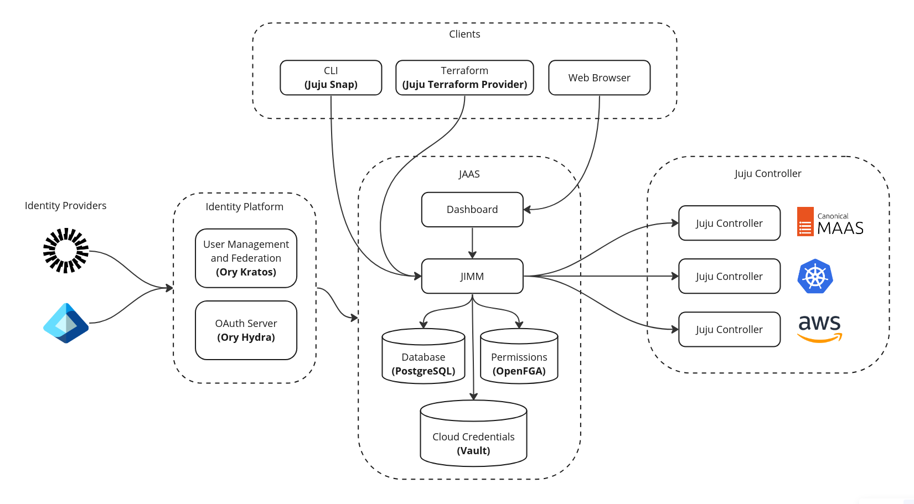

(jaas-architecture)=
# Architecture

The diagram below shows an overall picture of JAAS architecture.

<!--
Note: JAAS diagram is already in a Miro board here: https://miro.com/app/board/uXjVKUIUKAc=/

There is also a backup of the board in this directory (named `jaas-diagram.rtb`) which can be used to restore on Miro (in case the original board mentioned above was no longer available).
-->



This includes the following components:

- Juju Intelligent Model Manager (JIMM)
- ReBAC authorisation (OpenFGA)
- Database (PostgreSQL)
- Secure storage (Vault)

JIMM is an API server that implements a number of Juju facades (i.e. endpoints) and behaves as a *Juju Controller*,
which under the hood proxies operations to underlying controllers. This enables
other tools, like the Juju Dashboard or Juju CLI, that communicate with a
Juju Controller to work seamlessly with JIMM.

For authentication, JAAS requires an *OIDC Provider*
(Hydra) that handles the standard OAuth2.0 flows including browser flow, device flow,
and client credentials.

The remainder of this document briefly goes into more detail on JAAS' deployment and scalability.

## Deployment

The components of JAAS are deployed via Juju K8s charms. This implies that in order to deploy JAAS, you
must first bootstrap a single Juju controller to manage the components of JAAS, this is described in
more detail in our {ref}`tutorial`.

Not all the components of JAAS are expected to be deployed on Kubernetes. With the use of Juju [offers](https://juju.is/docs/juju/manage-offers)
certain components can be deployed to virtual machines and used by the Kubernetes charms. These components
include PostgreSQL and Vault and can be deployed with their corresponding machine charms. Currently JIMM
and OpenFGA are only supported as Kubernetes charms.

## Scalability

There are several stateless and stateful components to JAAS.

### Stateless

- JIMM: The JIMM API server.
- OpenFGA: The OpenFGA API server.

```{note}
Although we've put JIMM here as a stateless service, it is partially stateful. See the section on communication for more info.
```

### Stateful

- PostgreSQL: The database used by JIMM and OpenFGA.
- Vault: The secure key-value store used by JIMM.

Currently, the JIMM, OpenFGA and Vault charms support scaling provided they are deployed on Kubernetes.
Scaling the database is not currently supported.

Adding more units via Juju is possible with the command `juju scale-application <application> 2` to scale an
application to N units, 2 in this example.

## Communication

Communication between clients and JIMM takes place via a websocket based API. This is identical to Juju's communication model
and enables the same Juju CLI to transparently communicate with a JIMM controller as if it were a Juju controller.

This websocket API makes Juju and JIMM, partially stateful. Once a websocket session is established, authentication is performed
and the session can be used to make further requests. The nature of this model means that once a connection is established to a
specific unit of JIMM, that connection cannot be moved without first re-establishing some state.
